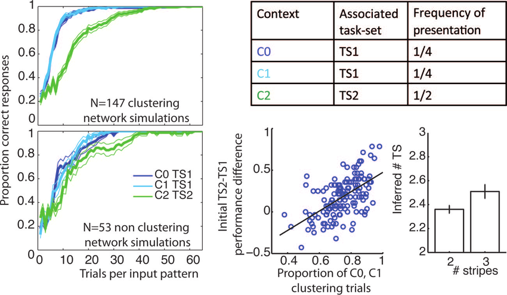

# Introduction

<!-- no \IEEEPARstart -->

This demo file is intended to serve as a \`\`starter file'' for IEEE conference papers produced under \LaTeX using IEEEtran.cls version 1.8b and later. <!-- You must have at least 2 lines in the paragraph with the drop letter
(should never be an issue) --> I wish you the best of success.

## Subsection Heading Here

Subsection text here.

### Subsubsection Heading Here

Subsubsection text here.

```{=raw}
An example of a floating figure using the graphicx package.
Note that \label must occur AFTER (or within) \caption.
For figures, \caption should occur after the \includegraphics.
Note that IEEEtran v1.7 and later has special internal code that
is designed to preserve the operation of \label within \caption
even when the captionsoff option is in effect. However, because
of issues like this, it may be the safest practice to put all your
\label just after \caption rather than within \caption{}.

Reminder: the "draftcls" or "draftclsnofoot", not "draft", class
option should be used if it is desired that the figures are to be
displayed while in draft mode.
```
```{=tex}
\begin{figure}[!t]
\centering
\includegraphics[width=2.5in]{myfigure.png}
% where an .eps filename suffix will be assumed under latex, and a .pdf suffix will be assumed for pdflatex; or what has been declared via \DeclareGraphicsExtensions.
\caption{Simulation results for the network.}
\label{fig_sim}
\end{figure}
```
```{=raw}
Note that the IEEE typically puts floats only at the top, even when this
results in a large percentage of a column being occupied by floats.


An example of a double column floating figure using two subfigures.
(The subfig.sty package must be loaded for this to work.)
The subfigure \label commands are set within each subfloat command,
and the \label for the overall figure must come after \caption.
\hfil is used as a separator to get equal spacing.
Watch out that the combined width of all the subfigures on a 
line do not exceed the text width or a line break will occur.
```
```{=tex}
\begin{figure*}[!t]
\centering
\subfloat[Case I]{\includegraphics[width=2.5in]{myfigure.png}%
\label{fig_first_case}}
\hfil
\subfloat[Case II]{\includegraphics[width=2.5in]{myfigure.png}%
\label{fig_second_case}}
\caption{Simulation results for the network.}
\label{fig_sim}
\end{figure*}
```
```{=raw}
Note that often IEEE papers with subfigures do not employ subfigure
captions (using the optional argument to \subfloat[]), but instead will
reference/describe all of them (a), (b), etc., within the main caption.
Be aware that for subfig.sty to generate the (a), (b), etc., subfigure
labels, the optional argument to \subfloat must be present. If a
subcaption is not desired, just leave its contents blank,
e.g., \subfloat[].

An example of a floating table. Note that, for IEEE style tables, the
\caption command should come BEFORE the table and, given that table
captions serve much like titles, are usually capitalized except for words
such as a, an, and, as, at, but, by, for, in, nor, of, on, or, the, to
and up, which are usually not capitalized unless they are the first or
last word of the caption. Table text will default to \footnotesize as
the IEEE normally uses this smaller font for tables.
The \label must come after \caption as always.
```
```{=tex}
\begin{table}[!t]
% increase table row spacing, adjust to taste
\renewcommand{\arraystretch}{1.3}
% !if using array.sty, it might be a good idea to tweak the value of
% \extrarowheight as needed to properly center the text within the cells
\caption{An Example of a Table}
\label{table_example}
\centering
% Some packages, such as MDW tools, offer better commands for making tables
% than the plain LaTeX2e tabular which is used here.
\begin{tabular}{|c||c|}
\hline
One & Two\\
\hline
Three & Four\\
\hline
\end{tabular}
\end{table}
```
```{=raw}
Note that the IEEE does not put floats in the very first column
- or typically anywhere on the first page for that matter. Also,
in-text middle ("here") positioning is typically not used, but it
is allowed and encouraged for Computer Society conferences (but
not Computer Society journals). Most IEEE journals/conferences use
top floats exclusively. 
Note that, LaTeX2e, unlike IEEE journals/conferences, places
footnotes above bottom floats. This can be corrected via the
\fnbelowfloat command of the stfloats package.
```
# Conclusion

The conclusion goes here.

{fig-align="center" width="7cm" height="4.2cm"}

<!-- conference papers do not normally have an appendix -->

# Methods

|        | Version  | Col3 |
|--------|----------|------|
| OpenCV | 4.9.0.80 |      |
| numpy  | 1.20     |      |
|        |          |      |

: Development platform specification

# Acknowledgment {#acknowledgment}

The authors would like to thank...

# Bibliography styles

Here are two sample references: [@Feynman1963118; @Dirac1953888].

\newpage

# References {#references .numbered}