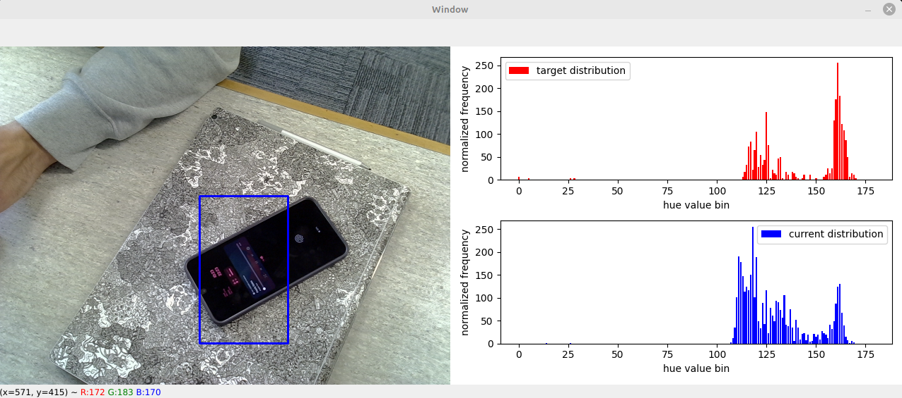
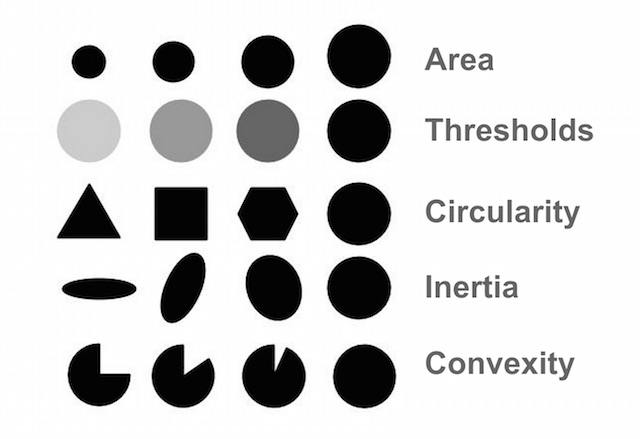

# COSC428 Lab 2 - Video Processing

## Objectives
The overall goal of this lab is to introduce basic OpenCV functions for:
- tracking objects
- detecting corners/features
- tracking the detected features
You will also learn how to use a depth camera (RGB + depth for each pixel, or RGBD) to:
- display, record and playback these RGBD images
- set attributes for a 3D camera

You will need to read and run some small applications written in Python. During this lab, you should enhance your understanding of concepts of computer vision video processing by implementing Python programs that demonstrate these concepts.

## Lab content

- [Activating Python environment](#activate-python-environment)
- [Lab preparation](#preparation)
- [Troubleshooting](#troubleshooting)
- [Kalman filters](#kalman-filters)
- [Histogram](#histogram-demonstration)
- [Mean shift](#mean-shift)
- [Harris features](#harris-features)
- [Blob detection](#blob-detection)
- [Lucas-Kanade optical flow](#lucas-kanade-optical-flow)
- [Displaying video from an RGB-D camera (Intel D435)](#displaying-video-from-an-rgb-d-camera-intel-d435)
- [Storing images from an RGB-D camera](#storing-images-from-an-rgb-d-camera)
- [Loading saved streams from an RGB-D camera](#loading-saved-streams-from-an-rgb-d-camera)
- [Segmentation from a depth image](#segmentation-from-a-depth-image)
- [Setting parameters with the D435](#setting-parameters-with-the-d435)
- [Comparing D435 parameters](#comparing-d435-parameters)

### Activate Python Environment
Activate the virtual environment for the classical computer vision labs (labs 1-3).

If you are running these scripts from a terminal, you can use the command below.

`source /csse/misc/course/cosc428/enviroments/classical/bin/activate`

If you would like to run from your IDE of choice, the python interpreter for this environment can be found here.

`/csse/misc/course/cosc428/enviroments/classical/bin/python3.9`

## Preparation
This lab can be downloaded from our gitlab repo, and we recommend cloning to the `/local` directory of your computer as the space on your network drive is limited. To avoid a `File exists` error when cloning, we create a folder using your student usercode (e.g. abc123).

`cd /local`

`mkdir -p $USER && cd $USER`

`git clone https://eng-git.canterbury.ac.nz/owb14/cosc428-lab2`

## Troubleshooting
- If you get a video I/O error, change the “0” in VideoCapture to “-1” which grabs the first available camera.
- If you still cannot access the camera at any time, try unplugging it and plugging it back in.
- You can check your camera exists on Linux with: `ls /dev/video*` in the bash terminal.
- If you get a "RuntimeError: Couldn't resolve requests" error when running one of the D435 scripts,
make sure that you're using a USB3 port.

## Kalman Filters
The Kalman filter is used to filter a series of noisy measurements with a view to generating a more accurate output than what would be possible if the measurements were considered on their own. More importantly, however, the Kalman filter allows us to interpolate the position of objects that aren’t always visible. Loosely speaking, a Kalman filter works on the assumption that if one has some information about a system, it is possible to infer what the next state of the system might be. For example, a rolling ball is more likely to continue to follow the same trajectory from frame to frame than it is likely to suddenly change direction. 

For a proper explanation of how a Kalman filter works, there are many resources available online, such as [here](http://www.bzarg.com/p/how-a-kalman-filter-works-in-pictures/). Just remember that we only have two-dimensional image data available, so we only need to worry about the 2D case.

Another point of interest in the `kalman.py` example is the use of colour thresholding. The `cv2.inRange()` function returns a mask of all points in the image that fall within the range of RGB values provided. Just note that OpenCV uses BGR instead of RGB representation, so when entering your values into the arrays to feed into `cv2.inRange()`, make sure the blue value is the first item in the array, and the red value is the final item in the array. Note that even for an object that seems to be only a "single colour", varying light conditions mean that things are a bit more complicated to a computer. So, when it comes to selecting a upper and lower colour range, make sure you get readings from the light and dark side of an object.

Once we've generated an image mask of the ball, we create a contour around the mask and fit a sphere to the contour (similar to how we detected the coins in the previous lab). This serves as our marker for the ball on the screen. 

This example contains two examples. `track_ball()` where the ball tracking is done simply with colour-based segmentation, and `track_ball_with_kalman()`, where the ball is still tracked with colour-based segmentation, but the position is interpolated when the ball is not visible. A third example, `track_ball_with_unscented_kalman()` is also available. It's performance in this lab's example is comparable to the standard Kalman filter, but the unscented filter works much better for non-linear systems, should you encounter one of those in your project.

### To do:
- Run `kalman.py`.
- Have a look at the three algorithms, and see how they perform.
- Consider some other situations where we might want to use a Kalman filter:
    * Control theory
    * Digital signal processing

## Histogram Demonstration
A histogram is a graph that shows the frequency of occurrence of different values, such as pixel intensities in an image. By calculating the histogram of an image, computer vision algorithms can quickly identify the distribution of pixel values and use this information to perform a wide range of image processing tasks such as image enhancement, segmentation, object recognition, and tracking. For example, in object recognition, the histogram of an image can be used to identify the most salient features of an object by detecting the peaks and valleys in the histogram. Histograms can also be used to perform color-based image segmentation by clustering pixel intensities with similar values.

In this example we visualise the pixel intensity histogram of the camera input, and demonstrate the effect of brightness and saturation on this histogram.

### To do:
- Run `demhist.py`
- Change the trackbar values to adjust the brightness and saturation.
- Note how this effects the pixel intensity histogram:
    * Brightness changes where on the x-axis the bars are
    * Contrast changes how wide the bars are distributed

## Mean Shift
https://docs.opencv.org/4.x/d7/d00/tutorial_meanshift.html

Mean shift is an algorithm used in computer vision for object tracking and image segmentation. It operates by shifting points in a feature space towards the direction of maximum similarity to nearby points, effectively grouping together points that are close to each other in the feature space.

In the context of object tracking, mean shift is used to locate an object of interest in consecutive video frames. Given an initial estimate of the object's location in the first frame, the algorithm computes a new estimate in each subsequent frame by shifting the position of the object towards the area of maximum similarity in the feature space. The similarity between the current frame and the previous frame is usually defined in terms of color histograms or other image features.

In our example we use a hue histogram as our means of measureing simularity between frames. This can be seen with "red" being the target frame distrubution, and "blue" being the current frame distribution.

### To do:
- Run python `meanshiftdemo.py`
- Drag a box around a object of interest, the algorithm will measure and save the histogram of the boxed area (which is shown by the red distribution), and set this as the target.
- Move the object around, and the box should track the object.
- Note the blue distribution showing the measured histogram in the boxed area for each frame. The meanshift algorithm moves the box to minimise the difference with the red/target distribution.

## Harris Features
The Harris Corner Detector is a function for finding corners in an image by looking for sections of the image that have a large variation in intensity in every direction. The code for this example was largely lifted from the [OpenCV online documentation](https://opencv-python-tutroals.readthedocs.io/en/latest/py_tutorials/py_feature2d/py_features_harris/py_features_harris.html).

Corners are valuable as it is typically much easier to match the same corner from two slightly different frames than it is to match an edge or patch of colour. In computer vision, We call these easily identifiable points "features", hence "Harris Features".

In the example code, the image is converted to grayscale before being run through the Harris detector. The detected corners are then filtered, and the strongest corners are then drawn onto the original colour image for display.

### To do:
- Run `harris.py`.
- Look at the kinds of features detected, and see how many of them are maintained in successive frames.
- What does it take for a particular feature to be "lost"?
    * Fast movment
    * Different lighting conditions
    * Unclear corners (Black corner moving onto a black surface)

## Blob Detection
In addition to the previously described approaches to segmentation, there is also a method called “blob detection”. This approach binarizes an image with a series of thresholds, creates contours around connected regions and calculates the centroid of the contour. Blobs are detected from centroids that occur close to each other across images using different thresholds.

The blob detector has five parameters that can be used for filtering out different results. A visualisation of these parameters can be seen at the [end of this article on learnopencv.com](https://www.learnopencv.com/blob-detection-using-opencv-python-c/)

Most of these parameters are self-explanatory. Inertia and convexity bear some explanation, however:
- The measure of a contour’s inertia around the centroid (similar inertia from physics). Thus, the closer all the points are to the center, the higher the inertia. Similarly, as the object stretches out to a line, the inertia will decrease.
- The convexity of the object refers to how closely the convex hull of an object can approximate the object itself. In the case of a closed circle, the convex hull can perfectly match the perimeter of the circle. If a slice is taken out of the circle, then there is a section of the convex hull that no longer closely matches the perimeter of the object, and thus the “convexity” of the blob decreases.

Each of the five filter types can be toggled on and off, as well as assigned certain thresholds, albeit with some restrictions depending on the type:
- For circularity, convexity and inertia, the thresholds can vary between 0 and 1. 
- The area thresholds can be any positive floating-point value.
- The colour threshold can range between 0 and 255. The colour threshold is more of an intensity value, since the image is grayscale.

The example code for the blob detector reads in an image from the webcam and draws a circle around each detected blob. Changing the parameters between lines 10 and 34 will affect what sorts of blobs are detected. Note that the example code does not include all of the possible threshold values for each filter type. A full list of the parameters is listed in the OpenCV documentation for the [SimpleBlobDetector](https://docs.opencv.org/4.5.0/d8/da7/structcv_1_1SimpleBlobDetector_1_1Params.html).

## Lucas-Kanade Optical Flow
Along with the Harris corner detector, the Lucas-Kanade optical flow detector example was largely copied directly from [OpenCV online documentation](https://docs.opencv.org/4.5.0/d4/dee/tutorial_optical_flow.html) (with a slight change for pulling a video feed from a webcam rather than a video file).

Optical flow is a two-dimensional field of x,y values, indicating the motion between two frames of a scene. You can kind of think of this as the next logical step up from a difference image. Instead of just showing a binary representation of what has changed, it also shows how it has changed. It works by calculating the difference in location between detected features in the two frames.

In the real world, optical flow is used to track the movement of optical mice, and for determining the movement of a camera when performing optical SLAM (Simultaneous Localization and Mapping).

In this example, a maximum of 100 features are detected and tracked. As the features move through the frame, they leave a trail behind them to show the path they travelled. More advanced implementations will even attempt to track **all** points in an image.

### To do:
- Run `lucas_kanade.py`.
- Press `Ctrl-P` to display toggle buttons for camera, and points.
- Observe how the points are tracked as objects move around in the frame.
- Notice cases where the flow breaks down as tracking on features is lost.

## Displaying Video from an RGB-D Camera (Intel D435)
Note; D435 cameras are available during labs (or on request), and must be plugged into USB 3 input.
Up to now, we have been dealing with simple 2-dimensional cameras, where the only available data is a matrix of colour values. Range imaging cameras are capable of producing a 2-dimensional array of distance values, where each pixel stores the distance from the sensor to an object in the scene. RGB-D cameras are a combination of the two, where both colour and depth data is available in the same camera. 

There are several approaches to obtaining RGB-D data. In the case of the Intel D435, the colour data is provided by a simple RGB camera, much like those we have used previously. The depth data is obtained using a pair of infrared cameras which are used to perform [stereophotogrammetry](https://en.wikipedia.org/wiki/Computer_stereo_vision). The D435 also contains an infrared texture projector to provide more features for the stereophotogrammetry to take place, especially for objects which are flat and have a uniform colour.

Intel provides [librealsense](https://github.com/IntelRealSense/librealsense),  a C/C++ based library, for interfacing with the D435, as well as bindings for a range of other programming languages. Since we’re using Python in this course, we’ll be using the Python bindings.

The first example, `d435_streams.py`, produces a series of images for some of the streams available from the D435. These streams are:
- rs.stream.color: The data from the RGB camera. Just like the normal RGB camera streams we have used up until now.
- rs.stream.infrared: The data from one of the infrared cameras. Each pixel is an 8-bit intensity value.
- rs.stream.depth: The depth data calculated using stereophotogrammetry from the two infrared video streams. Each pixel is a single 16-bit value representing the distance from the camera. 

There are a couple of things that must be noted with these data streams, however.
- The colour data coming from the RGB camera needs to be reversed since OpenCV uses BGR format. This can be seen on line 11 (`rs.format.bgr8`).
- The depth data is stored in a 16-bit integer. The distance represented by each increment is dependent on the resolution specified by the “enable_stream” function call. You can find out what it currently is by querying the camera as shown in line 17 (`depth_scale = profile.get_device().first_depth_sensor().get_depth_scale()`).

*Note that all of the D435 scripts have a couple lines importing `sys` and appending `/usr/local/lib` to `sys.path`. This is only needed on the lab machines since pyrealsense2 was compiled specially for Python3.8 and the library is located in a non-standard location. If you want to do this on your own machines, it's much easier just to use Python3.7 and install `pyrealsense2` via pip.*

### To do:
- Run `d435_streams.py`.
- Notice how there's a maximum and minimum range that the camera can generate distance values for (much more limited than the 16-bit number would suggest!)
- Point the camera at a blank piece of paper. Observe how the IR frame is very different when compared to the color frame.

## Storing Images from an RGB-D Camera
There are a couple different ways of saving an RGB-D camera stream. For example, a lot of the example datasets save RGB and depth data as two folders containing a massive number of image files. This works well for portability, if at the cost of convenience. Fortunately, librealsense allows for saving the stream out to a .bag file. It’s not the most convenient if you want to edit the images later, but it works great for saving the camera stream for replaying later. `d435_to_file.py` shows how this can be done. The key detail is line 18, where the library is told to stream everything out to the .bag file (`config.enable_record_to_file(path_to_bag)`).

Note that on line 22 there is a call to rs.align. What this does is align all the streams to the specified stream (in this case, the RGB stream). This is necessary because the depth and RGB images are captured by difference cameras which have a slight offset from each other. As a result, some maths is necessary to make the outputs line up properly. Fortunately, this is all handled by the librealsense library.

### To do:
- Run `d435_to_file.py`.
- Make sure that you've generated a .bag file. We're going to use that very shortly.

## Loading Saved Streams from an RGB-D Camera
Of course, storing the camera data isn’t much use if you can’t make use of it later. `d435_from_file.py` illustrates how to get the video stream out of the .bag file. As you can see, it’s almost exactly the same as getting a stream from the D435.

Line 12 specifies the .bag file to read the incoming datastream from rather than attempting to use a camera (`config.enable_device_from_file(path_to_bag)`).

### To do:
- Run `d435_from_file.py`.
- Ensure that your saved streams are visible on the screen.

## Segmentation from a Depth Image
Much like how we performed colour-based segmentation on the 2D images, we can also perform segmentation based on the depth data from a 3D camera. In some ways, this is actually easier, since we only have to segment based on a single data channel, rather than dealing with the three channels of RGB. Of course, if you have a particularly tricky dataset, it might be valuable to combine both approaches.

Regardless, many of the steps are the same as the RGB segmentation example. For example, morphological operations are also used to close up any holes resulting from noise. This can be seen from the difference between the thresholded image and the image that results after the opening and closing operations. 

`d435_segmentation.py` contains a script that detects the outline of a box in the bottom of the image, draws a contour around the outside and then marks the centroid with a green dot.

There is a bit of a discrepancy in the bottom right corner of the box being detected. This is due to the box being somewhat reflective due to a plastic coating. This causes the infrared projector to be reflected quite strongly, messing with the ranging results of the camera. So if you’re trying to detect a shiny object, you might need to consider the camera angle if you plan to use this approach, or as mentioned earlier, think about leveraging the RGB data as well.

Additionally, note that aligning the images is necessary, even if you aligned the images when saving the camera stream. This is because the .bag file receives images directly from the camera rather than taking note of any processing done within the while loop of the Python script doing the saving.

### To do:
- Run `d435_segmentation.py`.
- Notice the issues with detecting the shiny plastic of the box.
- If you're feeling particularly keen, try using the RGB data to fix this issue. You'll want to look at some of the techniques described in Lab 2 for this.

## Setting Parameters with the D435
As discussed in Lab 1 with 2D cameras, there are a range of parameters in the D435 that can be controlled using librealsense. While they aren’t generally required, they can occasionally be useful, such as turning off the infrared emitter for outdoor use (using the controls-laserstate parameter), changing the infrared gain control (controls-laserpower), or things like the RGB camera contrast (controls-color-contrast). In the end, if you’re going to start playing around with the camera parameters, expect to be approaching this from the perspective of “guess and check”. `d435_parameters.py` contains a simple example for downloading/uploading these parameters from/to the camera.

Note that the camera needs to be in “advanced mode” to do this. The advanced mode setting is stored in non-volatile memory, so this will only need to be done once, even if you unplug the camera.

### To do:
- Run `d435_parameters.py`.
- Look at the parameters stored in the `d435_settings.json` file. This is a convenient way of ensuring consistent camera conditions between tests.

## Comparing D435 parameters
From looking at `d435_settings.json`, it is hard to understand the effects of each parameter on the output. Unfortunately, Intel hasn’t done much to describe what all of the parameters do, but they have made some presets available on the Realsense [git repository](https://github.com/IntelRealSense/librealsense/wiki/D400-Series-Visual-Presets). `d435_presets_demo.py` visualises the difference between these presets.

### To do:
- Run `d435_presets_demo.py`.
