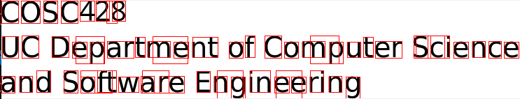

# COSC428 Lab 3 - 3D Computer Vision and Other Topics

## Objectives
The overall goal of this lab is to introduce advanced OpenCV functions for:
- generating 3D point clouds from multiple images (SLAM)
- text recognition
- visualising and manipulating 3D point clouds

You will need to read and run some small applications written in Python. During this lab, you should enhance your understanding of computer vision video processing concepts by implementing Python programs that demonstrate these concepts.

## Lab content

- [Activate Python environment](#activate-python-environment)
- [Lab preparation](#preparation)
- [Troubleshooting](#troubleshooting)
- [Tessaract OCR](#tesseract-ocr)
- [Open3D](#open3d)
- [Visual odometry (SLAM)](#visual-odometry-slam)

### Activate Python Environment
Activate the virtual environment for the classical computer vision labs (labs 1-3).

If you are running these scripts from a terminal, you can use the command below.

`source /csse/misc/course/cosc428/enviroments/classical/bin/activate`

If you would like to run from your IDE of choice, the python interpreter for this enviroment can be found here.

`/csse/misc/course/cosc428/enviroments/classical/bin/python3.9`

## Preparation
This lab can be downloaded from our gitlab repo, and we recommend cloning to the `/local` directory of your computer as the space on your network drive is limited. To avoid a `File exists` error when cloning, we create a folder using your student usercode (e.g. abc123).

`cd /local`

`mkdir -p $USER && cd $USER`

`git clone https://eng-git.canterbury.ac.nz/owb14/cosc428-lab3`

## Troubleshooting
- If you get a video I/O error, change the “0” in VideoCapture to “-1” which grabs the first available camera.
- If you still cannot access the camera at any time, try unplugging it and plugging it back in.
- You can check your camera exists on Linux with: `ls /dev/video*` in the bash terminal.

## Tesseract-OCR
OCR (optical character recognition) is the process of detecting characters in an image, and converting them into strings of text. Tesseract is an OCR engine that was originally written by HP in the 80s and 90s. The project has largely been taken over by Google since the code was open-sourced in 2005.

Tesseract can be run on Windows, OSX and Linux. By default, Tesseract assumes that the target language is English, but a range of languages can be detected. Additionally, it is possible to train Tesseract to detect additional languages if one wishes to detect an unsupported character set.

Note that Tesseract needs a clean, binarized image to work correctly. If there is excessive noise, there will be errors in the character recognition. Noise can be corrected using median filters and morphological operations, as discussed in other labs. The examples in this section are given under the assumption that any noise in the image has already been cleaned up.

### Obtaining English from an Image
The most simple use of Tesseract is simply to take an image and turn any text data into a string. For the first example (`ocr_simple_example.py`), the `simple_language.png` image from the lab directory is passed into Tesseract, and the output string is printed to the terminal.

#### To do:
- Run `ocr_simple_example.py` and compare it to the contents of the image.

### Detaling with Images Containing Multiple Languages
Note: Tesseract for English and Japanese are pre-installed on the COSC428 lab machines

Tesseract can also deal with images containing text from a number of languages. This is done by specifying the candidate languages with the “lang” parameter. The complete list of languages with pre-computed datasets can be found in the [Tesseract repository](https://github.com/tesseract-ocr/tessdoc/blob/master/Data-Files-in-different-versions.md). Note that languages other than English are not installed by default. To install additional languages under Linux, run “sudo apt-get install tesseract-ocr-<language_code>”.

#### To do:
- Run `ocr_mixed_language_example.py` and compare it to the contents of the image.

### Determining the Location of Text in an Image
In addition to simply printing out a line-by-line string of detected characters, Tesseract can also give the bounding box for each detected character instead. The output of the “image_to_boxes” method results a series of lines, where each line contains the detected character, and then the x0, y0, x1, y1 pixel coordinates of the bounding box.

#### To do:
- Run `ocr_bounding_box.py`.
- Look at how accurate the recognition is.

- As a part of the overall OCR section, try loading a photo of your handwriting in. How does Tesseract do for detection?

## Open3D
[Open3D](http://www.open3d.org/) is a library for manipulating and processing point clouds. Point clouds are simply large collections of coordinates which are generally used to represent points in 3D space. Given a sufficiently dense point cloud from some sort of sensor (such as a depth camera, or LIDAR device), it can be possible to discern shapes and features that can be used for a computer vision algorithm. Some of the key features of this library are surface reconstruction, registration, model fitting and segmentation.

Open3D is relatively new software, so it's not quite feature complete (as implied by being at v0.12 at time of writing), but compared to more well-developed libraries (such as PCL), it's much easier to install and work with. Python is also supported as a first-class API, too, meaning the [documentation](http://www.open3d.org/docs/release/) is fantastic.

### Visualising a Static Point Cloud
As you would expect, showing a 3D point cloud is pretty simple in Open3D, needing only a couple lines of code.

#### To do:
- Run `o3d_visualize_table.py`.
- Change the perspective on the scene using the mouse and keyboard. Controls are described in the [Open3D documentation](http://www.open3d.org/docs/release/tutorial/visualization/visualization.html).

### Statistical Outlier Filter
Point clouds are inherently noisy and so it is important to remove as much noise (outliers) as possible before analysing them.

A simple way of filtering out the noise from a point cloud is to use a statistical outlier filter. This finds the nearest n neighbours to the point being examined, and calculates the mean distance from this point to its neighbours. Any point which has a distance greater than a given threshold are marked as outliers and removed from the point cloud.

#### To do:
- Run `o3d_statistical_outlier_filter.py`.
- Examine the difference between the two point clouds.
- Play around with the parameters on line 6 to see how that changes the output.
- Also note that they're written to disk.

### Segmentation
Segmentation is the process of separating a point cloud into distinct clusters (groups of 3D points) based on some unifying concept. One of the most common uses of segmentation is to fit a plane to a point cloud in order to determine where the ground is.

In this example, we start with a point cloud of a scene containing a mug on a table, with a wall behind it. From here, three main steps are performed:
- Filter out any points outside a certain range, so that the point cloud only consists of the mug and the table top.
- Fit a plane to the remaining points using the RANSAC algorithm. This gives us the surface of our table as a separate point cloud. Save all the inliers for the fitted plane to a separate point cloud file.
- Take all the outliers from the previous step and fit a cylinder to them. This gives us all the points that make up the mug (handle sold separately). Save this to a separate point cloud file too.

As mentioned earlier, Open3D is still lacking some features. One of the more inconvenient ones is the lack of support for fitting most basic 3D shapes to a point cloud. Fortunately, [pyRANSAC-3D](https://leomariga.github.io/pyRANSAC-3D/) has been independently developed to fill this void.

#### To do:
- Run `o3d_segmentation.py`.
- Look at the output. How well did it figure out where the table and mug were?
- Uncomment line 77, and run it again. How well did that mug really do?

Turns out the cylinder RANSAC is not great in pyRANSAC-3D, either, unfortunately. But, you get the idea. If you do need to do this sort of analysis, look at PCL. It's harder to work with in a lot of ways, but it's more feature complete.

### Optional Section (if a camera is available): Streaming Depth Data from the Intel D435 to a Point Cloud
Conveniently, librealsense gives us access to a point cloud in addition to the 2D image streams from lab 3 which, with some simple manipulating, can readily be fed into Open3D. This is shown in `o3d_from_d435.py`.

As part of streaming this data, the point cloud data is also aligned to the RGB data, allowing for the points to all have the real colour of the scene applied to them. It's not perfect, but it's pretty good.

#### To do:
- Ask a tutor for a D435 camera.
- Run `o3d_from_d435.py` and observe the generated point cloud.

## Visual Odometry (SLAM)
Visual Odometry, or SLAM (Simultaneous Localization and Mapping) is the use of a computer vision algorithm to generate a map of the environment while also keeping track of where the video source is within the generated map. In contrast to the depth camera from the previous lab, this demo constructs a point cloud using a single camera. This is done using sequential frames from the camera, rather than requiring frames from two separate cameras. A downside to this approach is that the camera must then be moving, but in the case of SLAM, that isn’t generally a concern since the camera is moving around the environment to map it out in the first place.

Another important aspect of SLAM is the concept of “Loop Closure”. This is where the SLAM algorithm is able to identify when it has returned to a location it has been to previously, thus “closing the loop”. For this particular algorithm, this is achieved by detecting unique features in an image using the same algorithms used in the optical flow example from the previous lab (one of which is the Harris Feature detectorr from the previous lab) and comparing them to previously detected features using bundle adjustment.

This lab uses a script written by Sam Schofield, available at his [eng-git repository](https://eng-git.canterbury.ac.nz/sds53/cosc428-vo-example).

### To do:
- Getting all the relevant files in place, and ready to run is a bit finicky, so the "run_visual_odometry.sh" script has been written for your convenience. Simply run `sh run_visual_odometry.sh` inside your terminal from within the lab3 directory, and it will handle all of this for you. Everything will be extracted into the `visual_odometry` inside the lab3 directory. If you’re curious, you’re more than welcome to open up the shell script in a text editor like Atom or VS Code to see what it’s actually doing. Also, note that some of the files are quite large, so it will take a few minutes to download everything when you run the script for the first time. If it's taking a while, it might be worth moving on to the next example for the time being.

Once the example is running, a GUI will appear, showing the current frame being processed, and the detected features within it, as well as a second window containing the perspective of the camera, and the point cloud from the mapping process.

After the script is complete, a "results.txt" file will be saved to the `visual_odometry` folder. Each line is the position of the camera at each timestep, starting with the index of the file, three values representing camera position, and then four representing the rotation.
