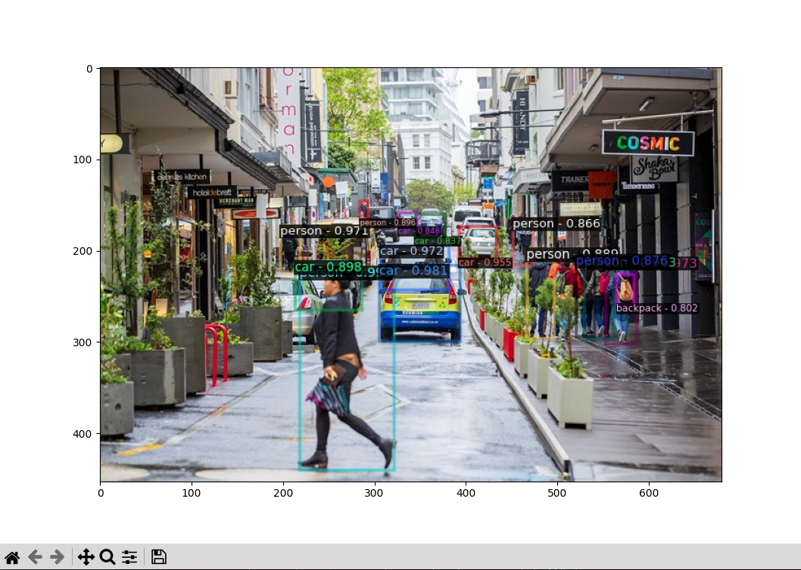
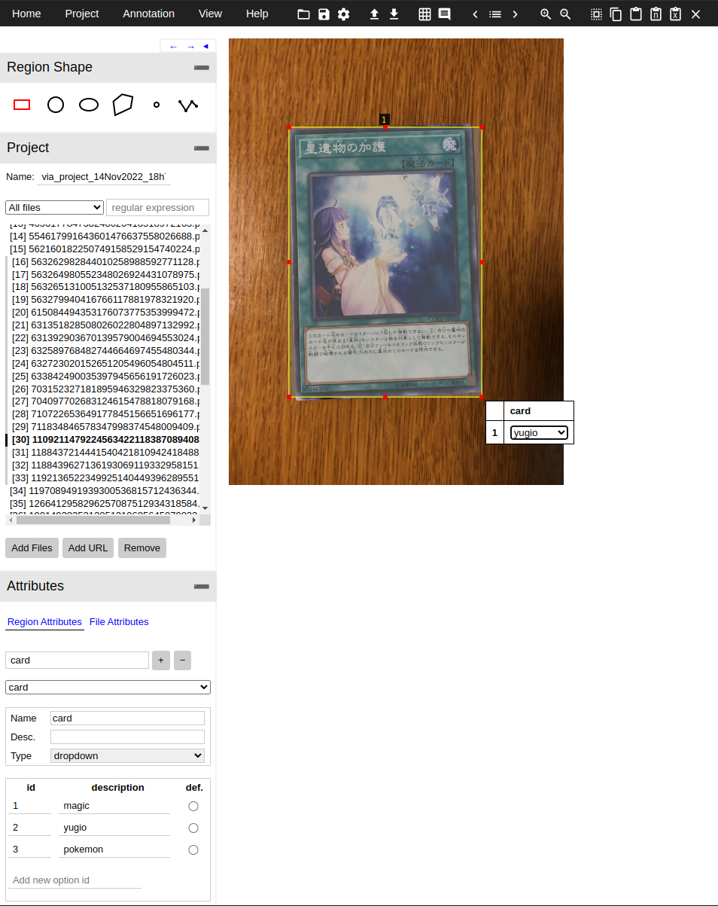
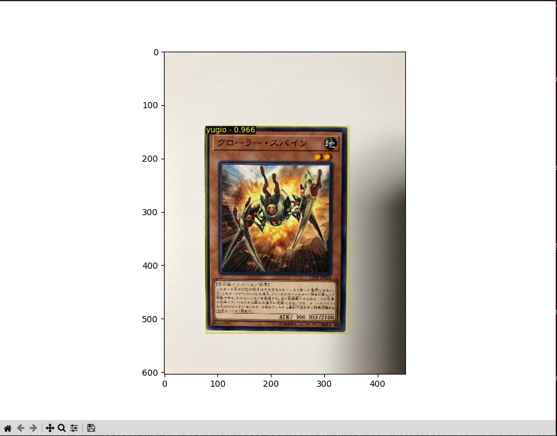
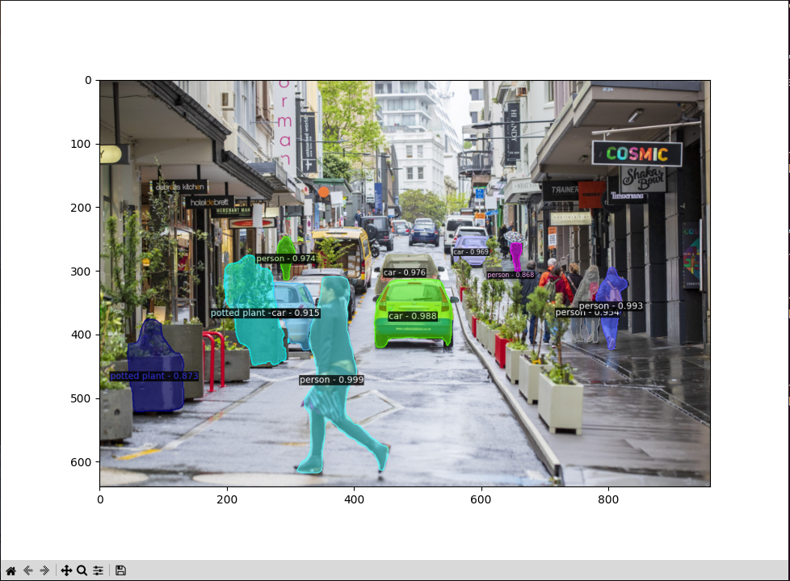
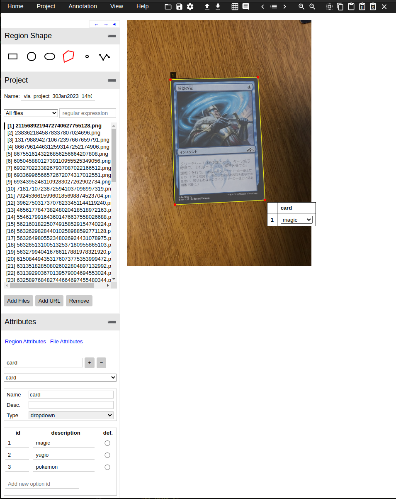
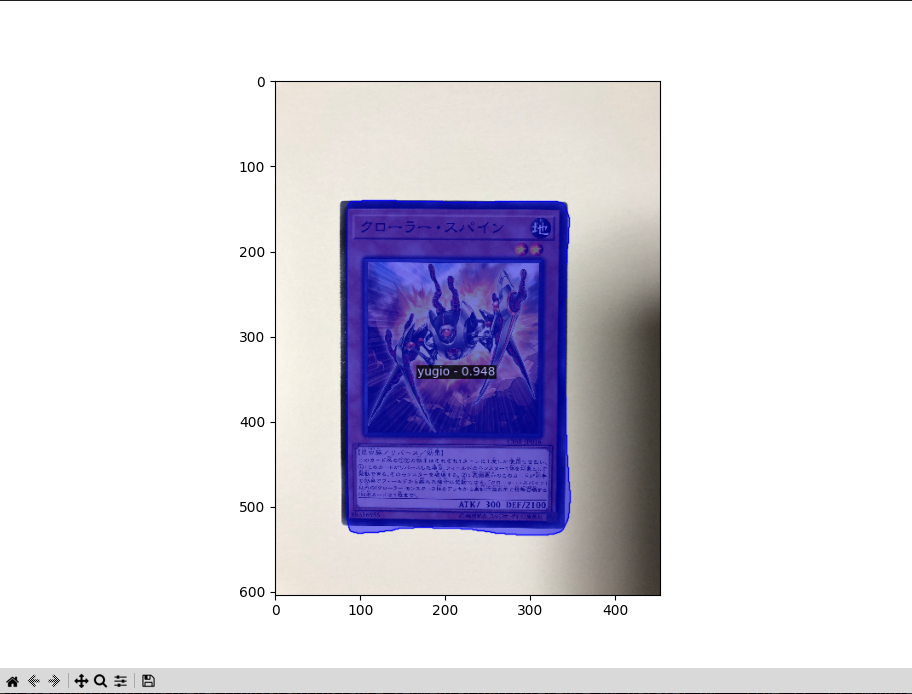
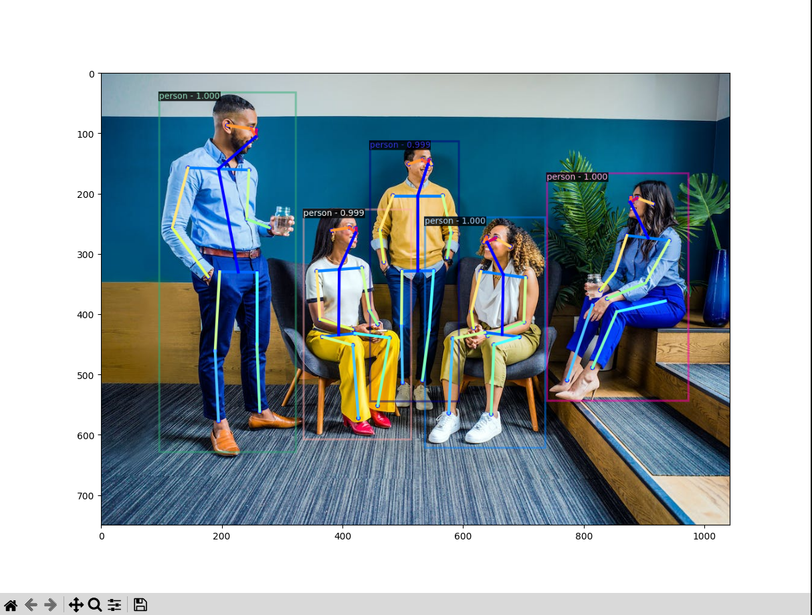

# COSC428 Lab 4b - Deep Learning for Pose and Object Recognition

## Objectives

The goal of this lab is to provide an introduction to the computer vision tasks objection detection, instance segmentation, and keypoint detection using deep neural networks. We do this using the Detectron2 project which provides a range of implemented methods, as well as pre-trained models.
- Run inference on an input image, using a pretrained model.
- Train the pretrained model further on a custom dataset (A concept know as transfer learning).
- Run inference on our newly trained model using out custom data.

## Lab content

- [Activate Python environment](#activate-python-environment)
- [Lab preparation](#preparation)
- [Background](#background)
- [Object detection](#object-detection)
- [Instance segmentation](#instance-segmentation)
- [Keypoint detection (pose estimation)](#keypoint-detection-pose-estimation)

### Activate Python Environment
Activate the virtual environment for the classical computer vision labs (labs 1-3).

If you are running these scripts from a terminal, you can use the command below.

`source /csse/misc/course/cosc428/enviroments/detectron2/bin/activate`

If you would like to run from your IDE of choice, the python interpreter for this enviroment can be found here.

`/csse/misc/course/cosc428/enviroments/detectron2/bin/python3.9`

## Preparation
Clone this lab to the `/local` directory on you lab computer, this lab can take considerable space, so we advise against using your home directory.

`cd /local`

`git clone https://eng-git.canterbury.ac.nz/owb14/cosc428-lab4`

# Background

Remember how in the last few labs we performed segmentation with colour (with varying results that are very dependent on how uniformly coloured the object is, and how consistent the lighting is), or using depth from a 3D camera? Well neural networks can help here too! 

Faster-RCNN and Mask-RCNN is the latest in a line of related neural network systems that have been successfully applied to image recognition. The details and history are a bit outside the scope of this lab, but if you're so inclined, you can read about it [here](https://blog.athelas.com/a-brief-history-of-cnns-in-image-segmentation-from-r-cnn-to-mask-r-cnn-34ea83205de4).

## Pretrained Models and Transfer Learning

The neural networks used in this lab require considerable computing and data resources to train, significantly beyond what we have available for this lab. Fortunately, the Detectron2 project has open-sourced the weights/models for these networks trained on the COCO Dataset, which contains approximately 300,000 images and around 100 object classes. We can use these models to run inference on our own images, detecting object classes represented in the COCO dataset. The act of running a neural network like this is called "inference." Here, we make no adjustments to the neural network itself and simply process the image using a "forward pass."

Additionally, we can use these models to train object detection on our own new classes with a fraction of the data and computing requirements. We can do this using a concept called transfer learning. This method fine-tunes the network from its COCO trained state to a slightly altered state that can detect our classes. The intuition behind this is that the vast majority of features/information learned in the initial training stage is common to all natural imagery. Hence, by using a pre-trained network, we can start with a generally applicable base of knowledge and learn the features/information that are specific to our new classes. This training process consists of a "forward pass" (processing the image), an error measurement comparing the output to the ground truth labels, and a "back pass" adjusting the network weights to minimize this error measurement.

# Object Detection

Object detection is the task of detecting instances of objects of a certain class within an image. In this example, we look at Faster R-CNN, an architecture that identifies objects within an image with its bounding box, class, and a confidence value between 0 and 1.

## Inference using COCO pretrained model

Here we use the COCO pretrained network discussed above to detect coco classes within an image.

## POTENTIALLY IMPORTANT FOR YOUR PROJECTS:
If you are adding more than 3 new object classes, you need to modify the `NUM CLASSES` variable in `./object_detection/configs/train_rcnn_fpn.yaml`.

### TODO:

Download COCO pretrained Faster-RCNN weights

`wget -P ./object_detection/weights https://dl.fbaipublicfiles.com/detectron2/COCO-Detection/faster_rcnn_R_50_FPN_1x/137257794/model_final_b275ba.pkl`

Run objection detection inference script

`python -m object_detection.inference_coco_dataset`

### What you should see:

## Labeling cards

Here we want to train our own network to detect cards that don't exist within the COCO dataset, hence we label our own dataset to give the network a training target or "ground truth".

### TODO:
 - Open `via_mod.html` using a web browser
 - Add files from `./data/cards_train` 'cards_train'
 - Add a 'card' region atribute of type drop down
 - Add ids 1-3 with descriptions 'magic', 'yugio', and 'pokemon' (these are our classes)
 - Use the rectangle region shape to annotate the card, and add a card classes using the drop down menu
 - Repeat for all cards (or atleast ~30)
 - Under the Annotation menu, select 'Export Annotations (COCO format)'
 - Move the downloaded json file to `./object_detection/labels/cards_train.json`
 - Repeat for 'cards_test' directory

### What you should see:

## Training card object detector

Now we use transfer learning to finetune the COCO pretrained network on our new dataset.

### TODO:
Run object detection training script

`python -m object_detection.train`

### What you should see:
`[11/14 20:41:39 d2.utils.events]:  eta: 0:01:51  iter: 19  total_loss: 1.589  loss_cls: 1.439  loss_box_reg: 0.1429  loss_rpn_cls: 0.004999 loss_rpn_loc: 0.004084  time: 0.1136  data_time: 0.0048  lr: 4.9953e-06  max_mem: 2030M`

`[11/14 20:41:42 d2.utils.events]:  eta: 0:01:47  iter: 39  total_loss: 1.481  loss_cls: 1.316  loss_box_reg: 0.1354  loss_rpn_cls: 0.003877  loss_rpn_loc: 0.003786  time: 0.1121  data_time: 0.0018  lr: 9.9902e-06  max_mem: 2030M`

`[11/14 20:41:44 d2.utils.events]:  eta: 0:01:48  iter: 59  total_loss: 1.27  loss_cls: 1.114  loss_box_reg: 0.1318  loss_rpn_cls: 0.00459  loss_rpn_loc: 0.005093  time: 0.1140  data_time: 0.0019  lr: 1.4985e-05  max_mem: 2030M`

`[11/14 20:41:46 d2.utils.events]:  eta: 0:01:47  iter: 79  total_loss: 0.974  loss_cls: 0.8542  loss_box_reg: 0.1418  loss_rpn_cls: 0.004968  loss_rpn_loc: 0.003661  time: 0.1148  data_time: 0.0019  lr: 1.998e-05  max_mem: 2030M`

`[11/14 20:41:49 d2.utils.events]:  eta: 0:01:43  iter: 99  total_loss: 0.7066  loss_cls: 0.5575  loss_box_reg: 0.1449  loss_rpn_cls: 0.003264  loss_rpn_loc: 0.004681  time: 0.1136  data_time: 0.0018  lr: 2.4975e-05  max_mem: 2030M`

## Inference using card model

After the training is complete you will see a model_final.pkl in the `./object_detection/logs directory`. We can run this using the following script to detect playing cards in an image.

### TODO:
 - Run object detection training script `python -m object_detection.inference_my_dataset`

### What you should see:

# Instance Segmentation

Instance Segmentation is an extention on the object detection task that includes generating a dense mask for the objects detected. The architecture we use for this is Mask R-CNN.

## Inference using COCO pretrained model

Here we use the COCO pretrained network discussed above to detect coco classes within an image.

### TODO:
Download COCO pretrained Mask-RCNN weights

`wget -P ./instance_segmentation/weights https://dl.fbaipublicfiles.com/detectron2/COCO-InstanceSegmentation/mask_rcnn_R_50_FPN_3x/137849600/model_final_f10217.pkl`

Run inference script the pretrained coco model

`python -m instance_segmentation.inference_coco_dataset`

### What you should see:

## Labeling cards

Here we want to train our own network to detect playing cards that don't exist within the COCO dataset, hence we label our own dataset to give the network a training target or "ground truth".

### TODO:
 - Open `via_mod.html` using a web browser
 - Add files from `./data/cards_train`
 - Add a 'card' region attribute of type drop down
 - Add ids 1-3 with descriptions 'magic', 'yugio', and 'pokemon' (these are our classes)
 - Use the n-point polygon shape to annotate the card, and add a card classes using the drop down menu
 - Repeat for all cards (or atleast ~30)
 - Under the Annotation menu, select 'Export Annotations (COCO format)'
 - Move the downloaded json file to `./instace_segmentation/labels/cards_train.json`
 - Repeat for 'cards_test' directory

### What you should see:

## Training card instance segmentation

Now we use transfer learning to finetune the COCO pretrained network on our new dataset.

### TODO:
 - Run instance_segmentation training script `python -m instance_segmentation.train`

### What you should see:
`[11/15 22:13:34 d2.utils.events]:  eta: 0:01:46  iter: 19  total_loss: 3.77  loss_cls: 2.55  loss_box_reg: 0.5046  loss_mask: 0.6948  loss_rpn_cls: 0.00397  loss_rpn_loc: 0.004189  time: 0.1099  data_time: 0.0050  lr: 4.9953e-06  max_mem: 2065M`

`[11/15 22:13:37 d2.utils.events]:  eta: 0:01:45  iter: 39  total_loss: 3.687  loss_cls: 2.433  loss_box_reg: 0.595  loss_mask: 0.6741  loss_rpn_cls: 0.00226  loss_rpn_loc: 0.004699  time: 0.1112  data_time: 0.0018  lr: 9.9902e-06  max_mem: 2065M`

`[11/15 22:13:39 d2.utils.events]:  eta: 0:01:43  iter: 59  total_loss: 3.279  loss_cls: 2.058  loss_box_reg: 0.5784  loss_mask: 0.6378  loss_rpn_cls: 0.002329  loss_rpn_loc: 0.005039  time: 0.1109  data_time: 0.0020  lr: 1.4985e-05  max_mem: 2065M`

`[11/15 22:13:41 d2.utils.events]:  eta: 0:01:41  iter: 79  total_loss: 2.704  loss_cls: 1.592  loss_box_reg: 0.5743  loss_mask: 0.5783  loss_rpn_cls: 0.003894  loss_rpn_loc: 0.00432  time: 0.1100  data_time: 0.0018  lr: 1.998e-05  max_mem: 2065M`

`[11/15 22:13:43 d2.utils.events]:  eta: 0:01:38  iter: 99  total_loss: 2.178  loss_cls: 1.019  loss_box_reg: 0.6209  loss_mask: 0.5191  loss_rpn_cls: 0.002507  loss_rpn_loc: 0.003703  time: 0.1096  data_time: 0.0018  lr: 2.4975e-05  max_mem: 2065M`

## Inference using our card model

After the training is complete you will see a model_final.pkl in the `./instance_segmentation/logs directory`. We can run this using the following script to detect playing cards in an image.

### TODO:
 - Run inference script for our trained card model `python -m instance_segmentation.inference_my_dataset`

### What you should see:

# Keypoint Detection (Pose Estimation)
Pose Estimation is the process of determining what pose a person is currently in based on some data. For example, where keypoints such as their head, hands, feet and joints are. There are a range of applications for this; the most common being for use in the film or video game industry. Until recently, the best option for those who couldn’t afford massive camera arrays and dozens of reflective dots, was to apply 3D camera technology. The most notable implementation of this method came from Microsoft with the Kinect camera on the Xbox 360.

Incredibly, we don’t even need a 3D camera anymore. Thanks to pretrained models and network, all we need to produce a shockingly good pose estimation is a simple 2D image.

## Inference using COCO pretrained model

Here we used a keypoint detection model trained on human features (head, torso, elbows, knees, etc...)

### TODO:
Download COCO pretrained keypoint detection weights

`wget -P ./keypoint_detection/weights https://dl.fbaipublicfiles.com/detectron2/COCO-Keypoints/keypoint_rcnn_R_50_FPN_1x/137261548/model_final_04e291.pkl`

Run objection detection inference script

`python -m keypoint_detection.inference_coco_dataset`

### What you should see:

