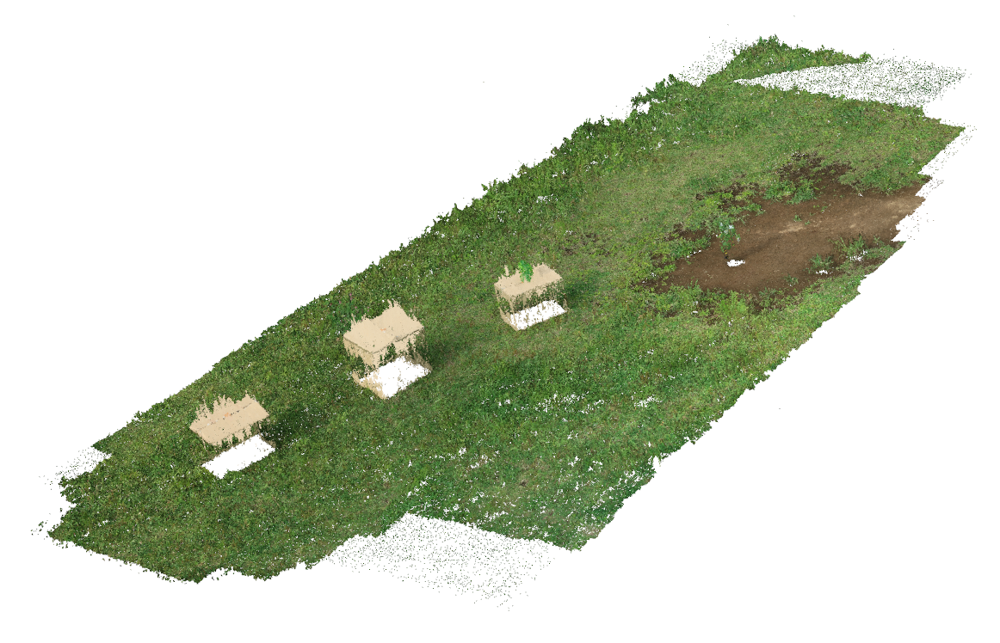
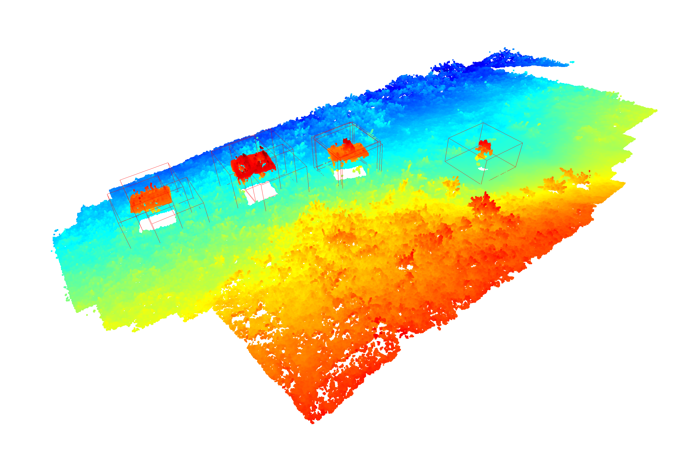
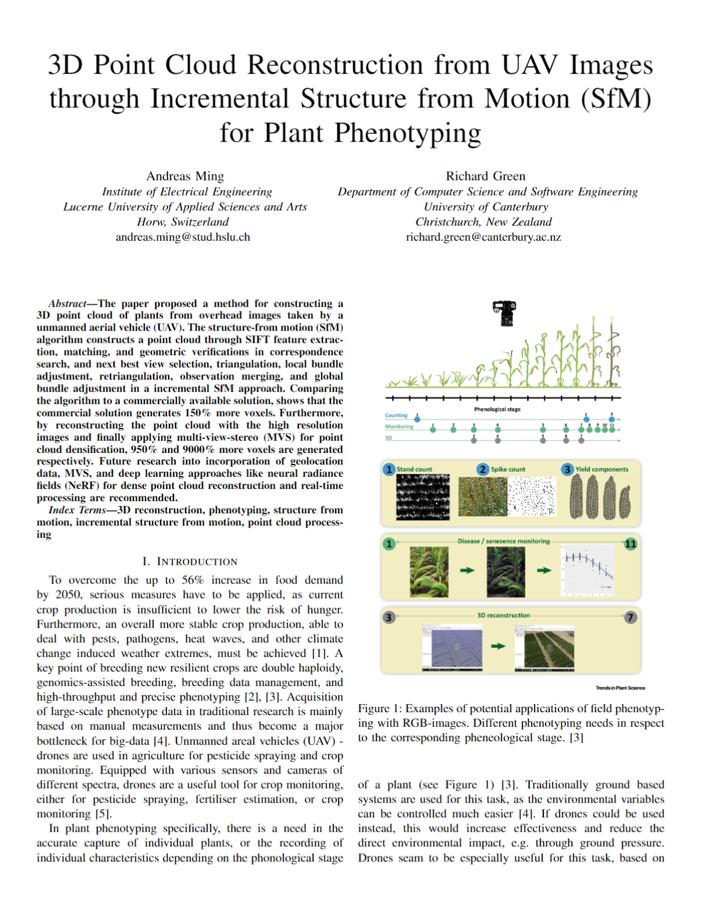

# 💡🧠🤔 3D Reconstruction from UAV Images for Plant Phenotyping 🌳🌲🌴

## 📝 Description:

This repository contains code for a incremental SfM, to reconstruct a point cloud from a field scene.

|                           |                                      |                              |
|:------------------------:|:---------------------:|:---------------------:|
|  |  |  |
|        Input scene        |       Pointcloud (PIX4Dmapper)       |     Plant bounding boxes     |

## 📒 Journal:

The project is documented in the form of a journal entry. The full document can be found [here](COSC428_Journal/CV_3Dreconstruction_journal.pdf).



## 💾 Data:

Please follow instructions to download data from this <a href="https://www.nature.com/articles/s41598-023-32167-6#data-availability">link</a>. <br>

## 🔧 Installation:

First, make sure you have Conda installed. Create a virtual environment and install all dependencies from `requirements.txt`.

If you are keen and have a proper machine, compile COLMAP to be supported by CUDA from the following <a href="https://colmap.github.io/install.html#build-from-source">link</a>

## 📈 Data Preparation:

If the above provided dataset is used, the images have to be reprocessed to use. Images must be in *.png* or *.jpg* format with the max resolution of 2472x1648. Use the following script to resize and convert the images.

First install

``` bash
pip install rawpy Pillow
```

Then execute

``` python
import os
import rawpy
from PIL import Image

def downscale_CR2(input_path, output_path, target_width=2472, target_height=1648):
    try:
        # Create output directory if it doesn't exist
        os.makedirs(output_path, exist_ok=True)

        # Iterate over each CR2 file in the input directory
        for filename in os.listdir(input_path):
            if filename.endswith(".CR2"):
                input_file = os.path.join(input_path, filename)
                output_file = os.path.join(output_path, filename.replace('.CR2', '_resized.jpg'))

                # Read CR2 file
                with rawpy.imread(input_file) as raw:
                    # Extract the raw image data and convert it to an RGB image
                    rgb = raw.postprocess()

                # Resize the image
                img = Image.fromarray(rgb)
                img = img.resize((target_width, target_height), Image.LANCZOS)

                # Save the resized image as JPEG
                img.save(output_file, format='JPEG')
                print(f"Downscaled and saved: {output_file}")

        print("Downscaling complete.")
    except Exception as e:
        print("Error:", e)


input_path = "input\path"
output_path = "output\path"
downscale_CR2(input_path, output_path)
```

## ▶️ 3D Reconstruction:

Execute `main.py` for incremental Structure-from-Motion.

## 📥 Contact

Should you have any questions, comments or suggestions please contact Dumbledore 🧙🏼‍♂️.